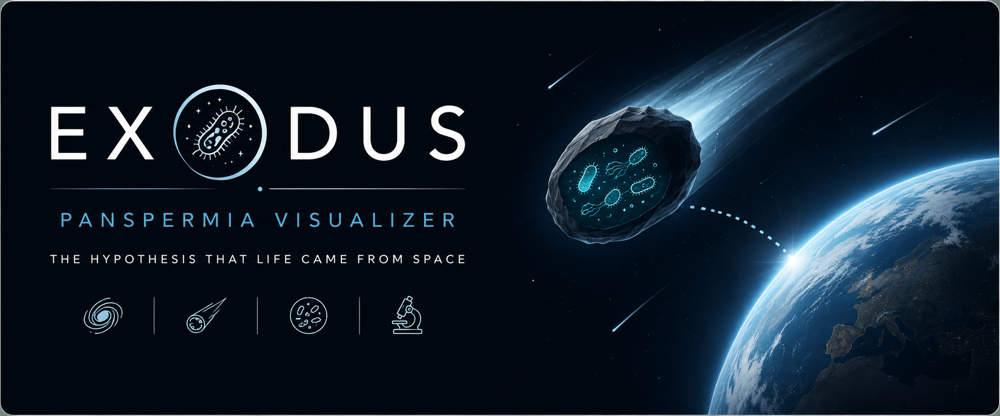

# EXODUS

**Panspermia Visualizer**

---

### Overview
**EXODUS** is an open-source educational visualization that explores the Panspermia Hypothesis through scientifically accurate animation and interactive bacterial cell anatomy. Designed for classrooms and self-learning, it combines astrobiology and microbiology into an engaging browser-based experience.

### Key Features
*   **Panspermia Simulation**: Interactive modeling of prebiotic transport mechanisms.
*   **Bacterial Cell Exploration**: Detailed anatomical breakdown of prokaryotic structures (Nucleoid DNA, Ribosomes, Flagellum, etc.).
*   **Scientific Annotation**: Includes hotspot annotations for key scientific concepts.
*   **Responsive Interface**: Browser-based with zoom and contrast controls for accessibility.

### Technical Parameters
*   **Platform**: Web-Based
*   **Focus**: Astrobiology & Microbiology Education
*   **License**: GPL-3.0

---

### About the Author
**Draven Ashcroft** | Bio-Lecturer | DIPS Chain of Institutions

*This project is dedicated to the advancement of science education and the study of the origin of life.*
